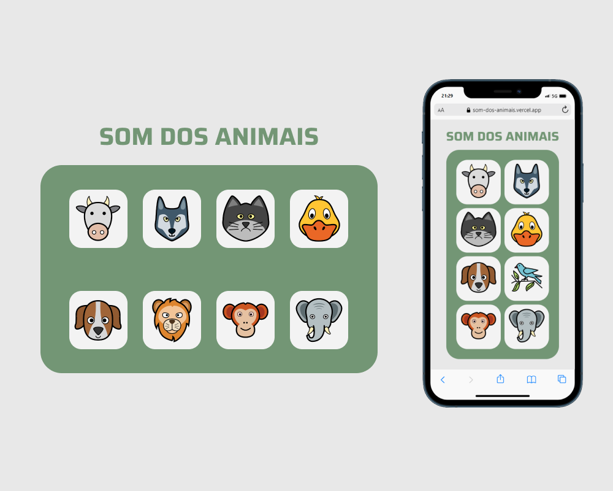

# Som dos Animais

Projeto desenvolvido para estudo a fim de proporcionar um site com teclas que, ao clicar, emitem sons de animais de acordo com o ícone. 

## 💻 Projeto

Tecnologias utilizadas: HTML, CSS e JavaScript. 

- Visite o projeto em: https://som-dos-animais.vercel.app

## 🖼 Preview do Projeto

  

